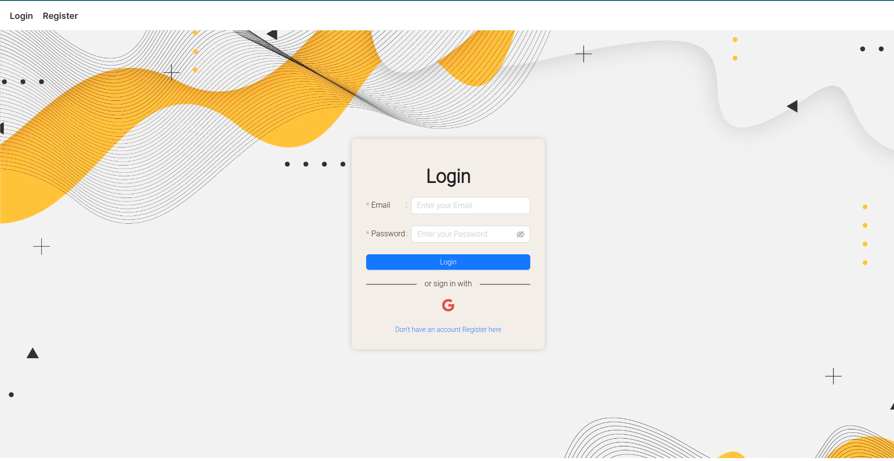
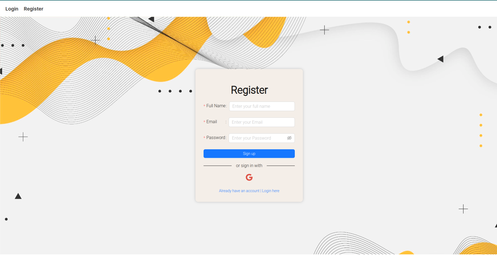
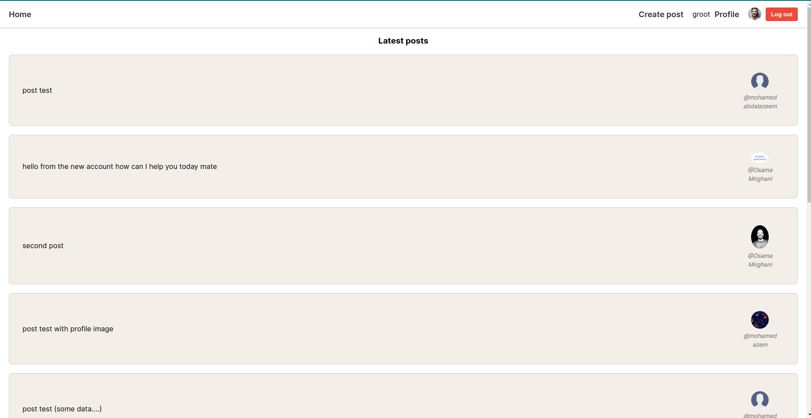
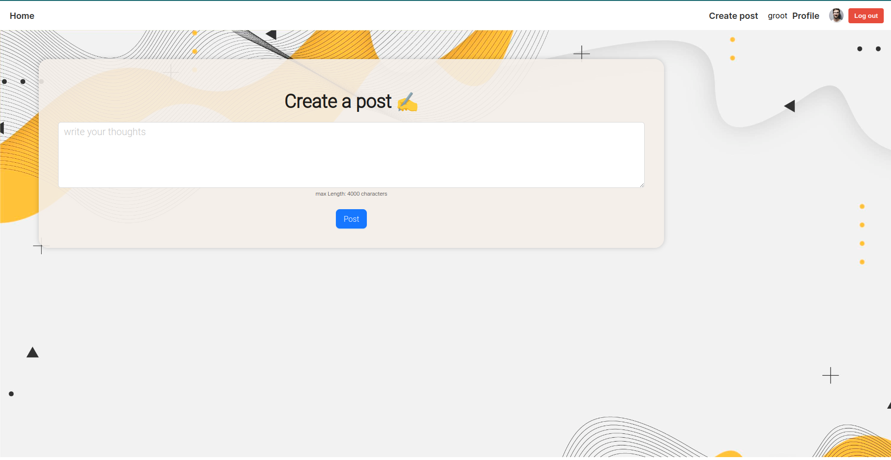
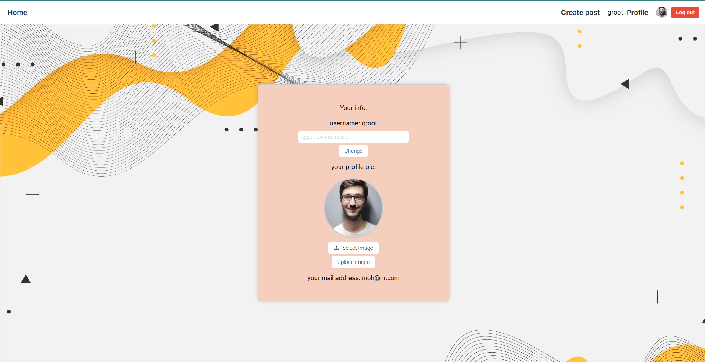

# React Social Media platform

This is a React js based social media platform clone that allows users to create profiles, create posts, and view posts from other users. It's a simple and intuitive platform that allows users to connect with other users by sharing their thoughts, ideas, and experiences through posts. 

### Tools Used

React js: A popular and widely used JavaScript library for building user interfaces. 
Firebase: A mobile and web application development platform that provides a range of tools and services to help developers build high-quality apps. 
Ant Design: A UI library for React that provides a set of high-quality React components and patterns.

</a> 
<a href="https://firebase.google.com/" target="_blank" rel="noreferrer"> 

## Features
User Authentication: Users can sign up and log in securely using Firebase Authentication. 
User Profiles: Users can create their own profiles and edit them, including uploading a profile picture and changing their username. 
Post Creation: Users can create posts by adding text. 
Post Feed: Users can view posts from other users on their feed. 
Responsive Design: The platform has a responsive design that adjusts to different screen sizes. 

## Overview

## Installation

To run this project locally, you will need to have Node.js and npm installed on your computer. Follow these steps: 

Clone the repository to your local machine. 
Navigate to the project directory and run npm install to install the dependencies. 
Create a Firebase account and set up a new project. 
In the Firebase console, go to Authentication and enable Email/Password as a sign-in method. 
In the Firebase console, go to Database and create a new Cloud Firestore database. 
In the Firebase console, go to Project settings and copy the Firebase configuration object. 
Create a new file firebase.js in the src directory and paste the Firebase configuration object into it. 
Run npm start to start the development server.